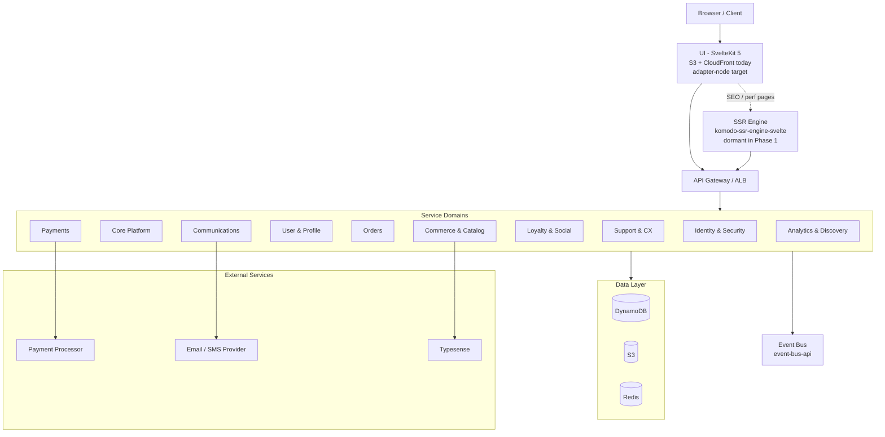
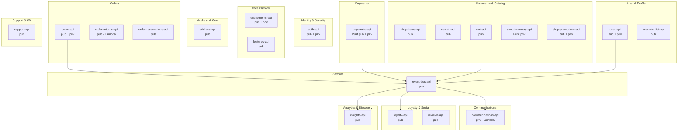
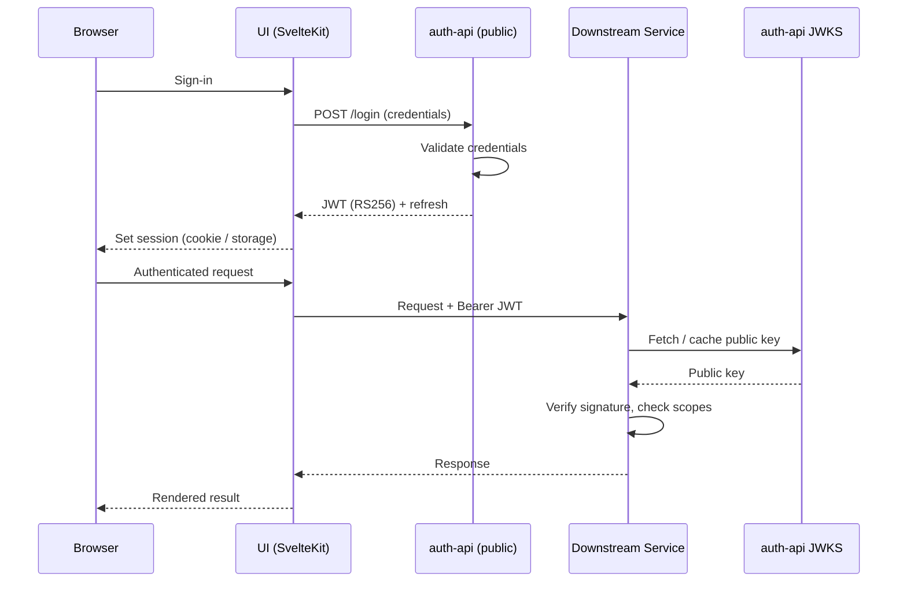
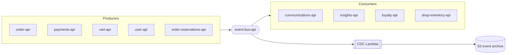

# Komodo — High-Level Architecture

> System-level view of Komodo. Domain groupings, top-level data flow, auth and event patterns, and the deployment trajectory from EC2 bootstrap to ECS Fargate. For container-level interactions and per-service topology see `docs/LLA.md`. For service-internal layering see `apis/<service>/docs/architecture.md`.

---

## 1. System Overview

<!-- FILL IN: 1 paragraph. The shape of the system at 30,000 ft — a SvelteKit frontend, a polyglot service mesh (Go + Rust) behind a gateway, an event-driven backbone, and AWS-managed data stores. Mention the deliberate split between public (`cmd/public`) and private (`cmd/private`) entrypoints. -->

---

## 2. Domain Map

<!-- FILL IN: 2-3 sentences on how domains were drawn. Note that public/private entrypoint split is a first-class architectural choice, not a deployment detail. -->

---

## 3. Service Registry

| Service | Language | Compute Target | Status | Entrypoint(s) |
|---------|----------|----------------|--------|---------------|
| ui | TS / SvelteKit 5 | S3 + CloudFront (today), adapter-node target | Live (static) | n/a |
| komodo-ssr-engine-svelte | TS / SvelteKit | EC2 / Fargate | Built, dormant | n/a |
| auth-api | Go | EC2 → Fargate | Ready | public + private |
| user-api | Go | EC2 → Fargate | Ready | public + private |
| shop-items-api | Go | EC2 → Fargate | Ready | public |
| cart-api | Go | EC2 → Fargate | Scaffolded | public |
| shop-inventory-api | Rust | EC2 → Fargate | Scaffolded | private |
| shop-promotions-api | Go | EC2 → Fargate | Scaffolded | public + private |
| search-api | Go | EC2 → Fargate | Foundation built (Typesense TODO) | public |
| order-api | Go | EC2 → Fargate | Scaffolded | public + private |
| order-reservations-api | Go | EC2 → Fargate | Foundation built (checkout flow TODO) | public |
| order-returns-api | Go | Lambda | Scaffolded | public |
| payments-api | Rust | Lambda → Fargate | Lambda handler TODO | public + private |
| communications-api | Go | Lambda | Lambda handler TODO | private |
| event-bus-api | Go | EC2 → Fargate | Built, not deployed | private (+ CDC Lambda) |
| entitlements-api | Go | Lambda | Dockerfile + handler TODO | public + private |
| features-api | Go | Lambda | Dockerfile + handler TODO | public |
| address-api | Go | Lambda | Dockerfile + handler TODO | public |
| support-api | Go | EC2 → Fargate | Implemented (in-memory; wire DDB before prod) | public |
| reviews-api | Go | EC2 → Fargate | Scaffolded | public |
| loyalty-api | Go | EC2 → Fargate | Scaffolded | public |
| user-wishlist-api | Go | EC2 → Fargate | Scaffolded | public |
| insights-api | Go | EC2 → Fargate | Scaffolded | public |

---

## 4. Data Architecture Overview

<!-- FILL IN: 1-2 paragraphs. DynamoDB-first with single-table designs per service, S3 for static + media + raw event archive, Redis for session/rate-limit/cache. Each service owns its data — no cross-service DB reads. Cross-service data needs flow through APIs or events. -->

**Storage by class**

| Class | Store | Use |
|-------|-------|-----|
| Operational records | DynamoDB | Per-service single-table designs |
| Media + static | S3 | Product images, static UI build |
| Cache + session + rate-limit | Redis | Hot reads, ephemeral state |
| Event archive | S3 (via event-bus-api / CDC Lambda) | Replay, audit, analytics |
| Search index | Typesense (planned) | `search-api` backend |

<!-- DIAGRAM: Data ownership / domain ER diagram showing which service owns which entity, and where events cross domain boundaries. Recommended tool: Mermaid `erDiagram` or Excalidraw. -->

---

## 5. External Integrations

| System | Purpose | Integration Point | Status |
|--------|---------|-------------------|--------|
| Payment processor (Stripe, etc.) | Card processing, payouts | payments-api | Planned |
| Email / SMS provider (SES, Postmark, Twilio) | Transactional notifications | communications-api | Planned |
| Typesense | Catalog search | search-api | Planned |
| AWS Cognito (decision pending) | <!-- FILL IN: or stay self-hosted JWT? --> | auth-api | <!-- FILL IN --> |
| AWS Secrets Manager | Secret distribution | All services via forge SDK `aws/secrets-manager` | Active (LocalStack locally) |
| CloudWatch / OTel collector | Logs, metrics, traces | All services | Planned |
| <!-- FILL IN --> | | | |

---

## 6. Auth & Security Architecture

<!-- FILL IN: 1 paragraph. OAuth 2.0 issuance via auth-api, JWT RS256 with public-key validation at each downstream service via forge SDK middleware. Note CSRF + sanitization on the public middleware stack and scope-based gating on the private stack. -->

**Middleware stacks (per `cmd/` convention)**

| Stack | Middleware order |
|-------|------------------|
| `cmd/public/` | RequestID → Telemetry → RateLimiter → CORS → SecurityHeaders → Auth → CSRF → Normalization → Sanitization |
| `cmd/private/` | RequestID → Telemetry → Auth → Scope |

---

## 7. Event-Driven Architecture

<!-- FILL IN: 1 paragraph. event-bus-api as the in-cluster broker for Phase 1; CDC Lambda for change-data-capture into the archive. Producers emit typed events (forge SDK `events` package); consumers subscribe. Note the Phase 3 transition to a dedicated backbone (EventBridge / MSK). -->

---

## 8. Deployment Architecture

<!-- DIAGRAM: AWS topology — VPC, public/private subnets, ALB, EC2 / Fargate tasks, Lambda functions, DynamoDB, S3, CloudFront, Route 53. Recommended tool: Lucidchart, Excalidraw, or AWS official icon set in draw.io. -->

| Environment | Compute | Config Management | CI/CD Status |
|-------------|---------|-------------------|--------------|
| Local | Docker Compose + LocalStack | `infra/local/services.jsonc`, `.env` | Manual via `just` |
| Dev | EC2 (docker-compose) + Lambda | AWS Secrets Manager via forge SDK | GitHub Actions disabled (workflow_dispatch only) |
| Prod (Phase 1) | EC2 (docker-compose) + Lambda | AWS Secrets Manager | Manual until backend live |
| Prod (Phase 2+) | ECS Fargate + Lambda | AWS Secrets Manager + SSM Parameter Store | GitHub Actions auto-trigger re-enabled |

---

## 9. Scalability & Evolution Narrative

<!-- FILL IN: 2-3 paragraphs. The platform was built with a deliberate "low-cost bootstrap, no shortcuts that block scale-up" stance. Walk through the planned transitions and what triggers each. -->

**Planned transitions**

> **Frontend: `adapter-static` → `adapter-node`.** Triggered when real backend is live and SSR / dynamic data fetching is needed. Commented import already in `ui/svelte.config.js`.

> **SSR engine activation.** `komodo-ssr-engine-svelte` (port 7003) comes online when SEO and LCP demands justify the operational cost of a second rendering tier.

> **Compute: EC2 docker-compose → ECS Fargate.** Triggered when EC2 vertical scaling hits ceiling or operational toil from manual deploys exceeds Fargate cost. CloudFormation templates in `infra/deploy/cfn/` are ready; `cmd/public` and `cmd/private` entrypoints map cleanly to Fargate task definitions.

> **CI/CD: manual dispatch → automatic.** Re-enable `on:` blocks in `ci.yml` and `deploy-dev.yml` once dev environment stabilizes.

> **Search: scaffold → Typesense.** Wire `search-api` to a real index, with event-driven sync from `shop-items-api` and `shop-inventory-api` via `event-bus-api`.

> **Payments / Inventory: Go V1 (where present) → Rust V2.** Shadow-traffic A/B before flipping primary.

> **Phase 3 backbone: in-cluster `event-bus-api` → managed broker (EventBridge / MSK).** Triggered when cross-vertical fan-out demands isolation and durable replay at scale.
