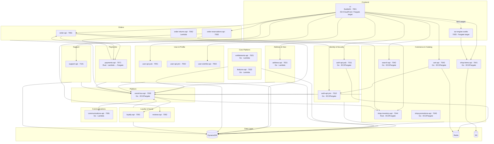
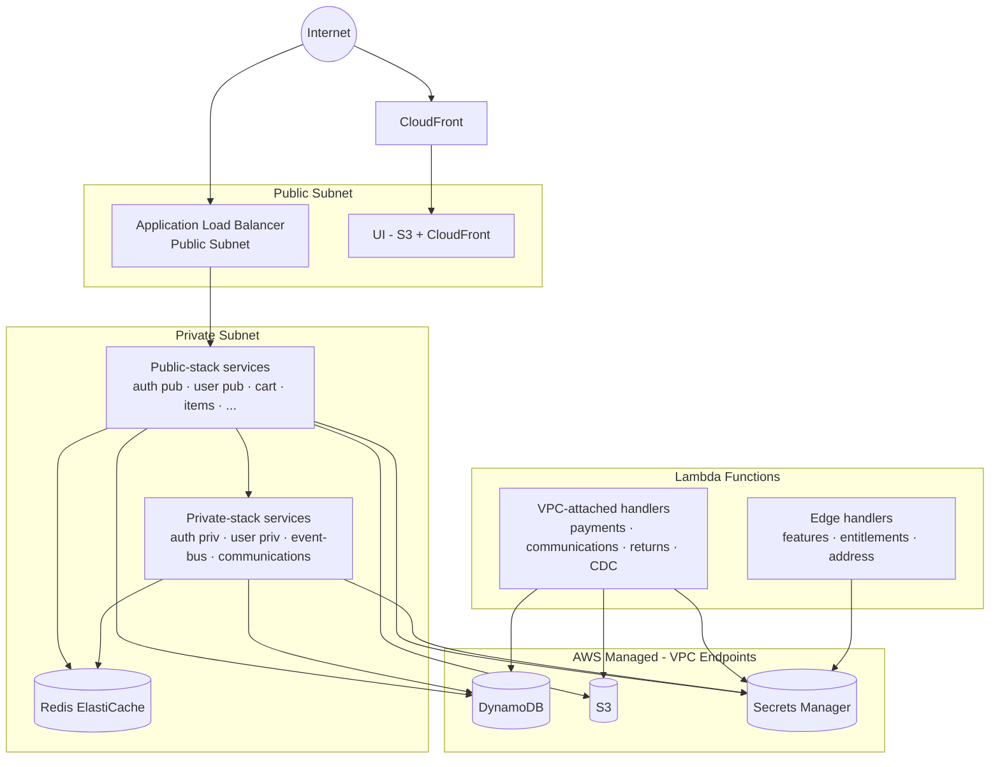
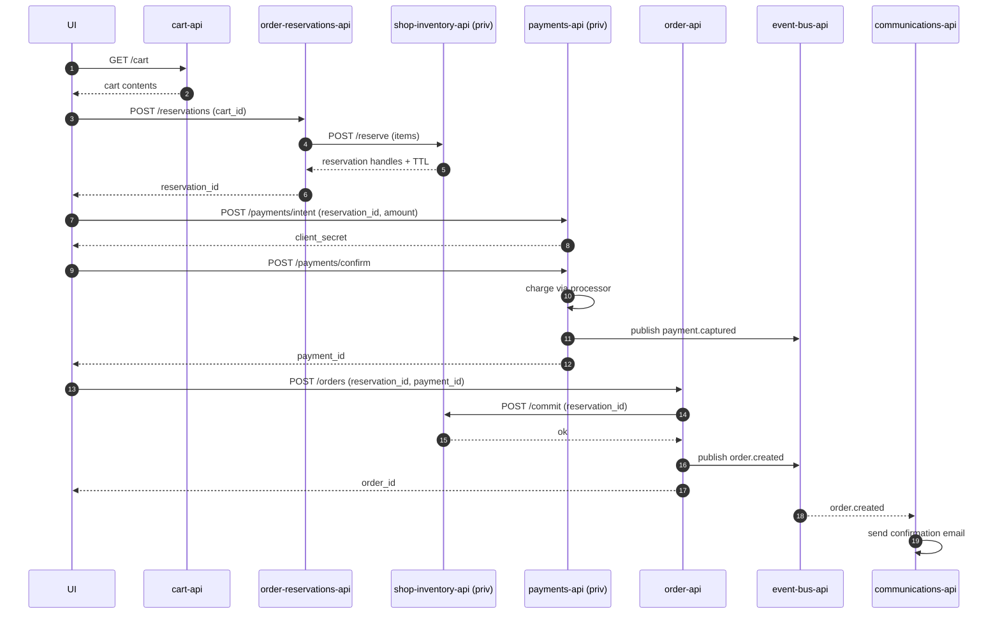
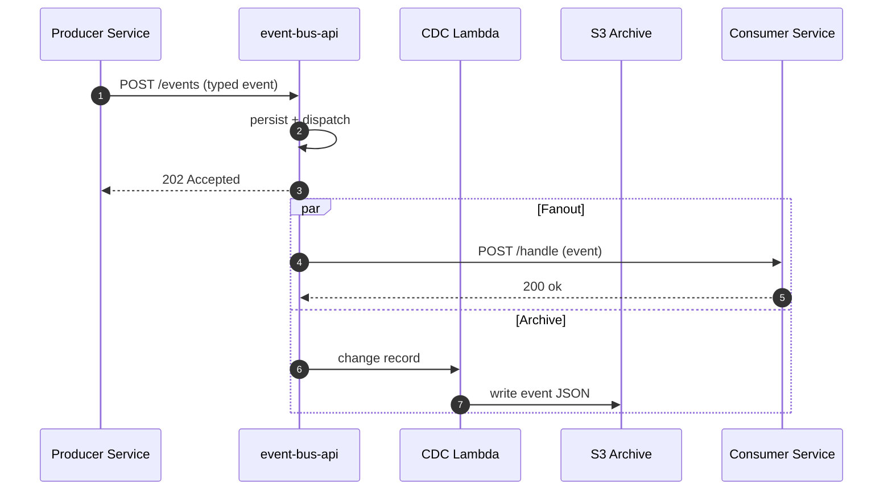

# Komodo — Low-Level Architecture

> Container topology and inter-service interaction layer. This document answers: how do these services actually talk to each other at runtime, where does data live, and what is the network shape that supports it.

---

## 1. Scope & Purpose

This document sits between two others:

- **`docs/HLA.md`** — domain view, product zones, top-level data flow. *Why the system is shaped this way.*
- **`docs/LLA.md`** *(this file)* — container topology, runtime interactions, network and data boundaries. *How the pieces talk.*
- **`apis/<service>/docs/architecture.md`** — internal layering of a single service (handler → service → repo). *How one service is built.*

Use this doc when you need to reason about cross-service calls, data ownership, deployment placement, or network boundaries. Use HLA when you need product / domain context. Use per-service docs when you are inside a single codebase.

---

## 2. Container Topology

<!-- FILL IN: 2-3 sentences. Note the polyglot mix (Go + Rust), the public/private entrypoint split per service, and the local `komodo-network` Docker network bridging everything in dev. -->

> **Local dev:** every container above attaches to the `komodo-network` Docker bridge created by `just up`. Individual service composes reference it as `external: true`.

---

## 3. Service-to-Service Interaction Matrix

> Caller is always the initiator. `event` rows are publish/subscribe via `event-bus-api`, not direct calls.

| Caller | Callee | Protocol | Auth Mechanism | Sync / Async |
|--------|--------|----------|----------------|--------------|
| ui | auth-api (pub) | REST | None / refresh token | Sync |
| ui | shop-items-api | REST | JWT (user scope) | Sync |
| ui | search-api | REST | JWT (user scope) | Sync |
| ui | cart-api | REST | JWT (user scope) | Sync |
| ui | order-api | REST | JWT (user scope) | Sync |
| ui | order-reservations-api | REST | JWT (user scope) | Sync |
| ui | user-api (pub) | REST | JWT (user scope) | Sync |
| ui | address-api | REST | JWT (user scope) | Sync |
| ui | reviews-api | REST | JWT (user scope) | Sync |
| ui | support-api | REST | JWT (user scope) | Sync |
| ui | wishlist-api | REST | JWT (user scope) | Sync |
| ssr-engine-svelte | shop-items-api | REST | JWT (service token) | Sync |
| cart-api | auth-api (priv) | REST | Service JWT | Sync |
| cart-api | shop-items-api | REST | Service JWT | Sync |
| cart-api | shop-promotions-api | REST | Service JWT | Sync |
| order-reservations-api | shop-inventory-api | REST | Service JWT | Sync |
| order-reservations-api | payments-api (priv) | REST | Service JWT | Sync |
| order-api | payments-api (priv) | REST | Service JWT | Sync |
| order-api | user-api (priv) | REST | Service JWT | Sync |
| order-api | event-bus-api | REST | Service JWT | Async (publish) |
| payments-api | event-bus-api | REST | Service JWT | Async (publish) |
| cart-api | event-bus-api | REST | Service JWT | Async (publish) |
| user-api | event-bus-api | REST | Service JWT | Async (publish) |
| event-bus-api | communications-api | REST | Internal-only (VPC + service JWT) | Async (push) |
| event-bus-api | loyalty-api | REST | Internal-only | Async (push) |
| event-bus-api | shop-inventory-api | REST | Internal-only | Async (push) |
| event-bus-api | insights-api | REST | Internal-only | Async (push) |
| communications-api | (email/SMS provider) | HTTPS | API key (Secrets Manager) | Sync (egress) |
| payments-api | (payment processor) | HTTPS | API key (Secrets Manager) | Sync (egress) |
| <!-- FILL IN: any caller/callee not yet captured --> | | | | |

---

## 4. Data Store Ownership

> Each service owns its data. Cross-service reads go through APIs or events — never direct DB access.

| Service | Primary Store (DynamoDB Table) | Secondary | Cache (Redis) |
|---------|-------------------------------|-----------|---------------|
| auth-api | `komodo_auth` <!-- TBD confirm --> | — | Yes (sessions, JWKS cache) |
| user-api | `komodo_users` <!-- TBD --> | — | No |
| user-wishlist-api | `komodo_wishlists` <!-- TBD --> | — | No |
| address-api | `komodo_addresses` <!-- TBD --> | — | No |
| shop-items-api | `komodo_items` <!-- TBD --> | S3 (media) | Optional |
| search-api | — (Typesense index) | — | No |
| cart-api | `komodo_carts` <!-- TBD --> | — | Yes (hot carts) |
| shop-inventory-api | `komodo_inventory` <!-- TBD --> | — | Optional |
| shop-promotions-api | `komodo_promotions` <!-- TBD --> | — | Optional |
| order-api | `komodo_orders` <!-- TBD --> | — | No |
| order-reservations-api | `komodo_reservations` <!-- TBD --> | — | Yes (TTL holds) |
| order-returns-api | `komodo_returns` <!-- TBD --> | — | No |
| payments-api | `komodo_payments` <!-- TBD --> | — | No |
| communications-api | `komodo_messages` <!-- TBD --> | — | No |
| event-bus-api | `komodo_events` <!-- TBD --> | S3 (archive via CDC) | No |
| entitlements-api | `komodo_entitlements` <!-- TBD --> | — | Optional |
| features-api | `komodo_features` <!-- TBD --> | — | Yes (flag cache) |
| loyalty-api | `komodo_loyalty` <!-- TBD --> | — | No |
| reviews-api | `komodo_reviews` <!-- TBD --> | — | No |
| support-api | TBD (currently in-memory; wire DDB before prod) | — | No |
| insights-api | `komodo_insights` <!-- TBD --> | S3 (raw events) | No |

> **Per-service detail:** authoritative table designs, GSIs, and access patterns live in `apis/<service>/docs/data-model.md`.

---

## 5. Compute Classification

| Service | Local (Docker) | EC2 Target | Lambda Target | Fargate Target | Notes |
|---------|----------------|------------|---------------|----------------|-------|
| ui | Yes | — | — | (adapter-node) | Static today (S3+CF) |
| ssr-engine-svelte | Yes | — | — | Yes | Dormant in Phase 1 |
| auth-api | Yes | Yes | — | Yes | pub + priv binaries |
| user-api | Yes | Yes | — | Yes | pub + priv binaries |
| user-wishlist-api | Yes | Yes | — | Yes | |
| address-api | Yes | — | Yes | (later) | Lambda handler TODO |
| shop-items-api | Yes | Yes | — | Yes | |
| search-api | Yes | Yes | — | Yes | Typesense integration TODO |
| cart-api | Yes | Yes | — | Yes | |
| shop-inventory-api | Yes | Yes | — | Yes | Rust binary |
| shop-promotions-api | Yes | Yes | — | Yes | pub + priv |
| order-api | Yes | Yes | — | Yes | pub + priv |
| order-reservations-api | Yes | Yes | — | Yes | Checkout flow TODO |
| order-returns-api | Yes | — | Yes | (later) | Lambda |
| payments-api | Yes | — | Yes | (later) | Rust · Lambda handler TODO |
| communications-api | Yes | — | Yes | (later) | Lambda handler TODO |
| event-bus-api | Yes | Yes | — | Yes | + CDC Lambda |
| entitlements-api | Yes | — | Yes | (later) | Dockerfile + handler TODO |
| features-api | Yes | — | Yes | (later) | Dockerfile + handler TODO |
| loyalty-api | Yes | Yes | — | Yes | |
| reviews-api | Yes | Yes | — | Yes | |
| support-api | Yes | Yes | — | Yes | Wire DDB before prod |
| insights-api | Yes | Yes | — | Yes | |

---

## 6. Network & Security Boundaries

<!-- FILL IN: 1 paragraph. Public ALB terminates TLS and forwards to public-stack services. Private services live in private subnets, reachable only via VPC. Lambda functions are split: customer-facing edge handlers stay outside VPC for cold-start reasons; data-touching handlers attach to VPC. Redis and DynamoDB endpoints accessed via VPC endpoints (no public route). -->

<!-- DIAGRAM: VPC subnet map with CIDRs, NAT Gateway / VPC endpoints, security group relationships. Recommended tool: AWS-native draw.io stencils or Lucidchart. -->

---

## 7. Key Runtime Flows

### 7.1 Checkout Flow

### 7.2 Auth Flow

See `docs/HLA.md` §6 — *Auth & Security Architecture*. Not duplicated here.

### 7.3 Async Event Flow

> Events use the forge SDK `events` package — `events.New`, typed `EventType`, `Source`, `EntityType` constants. Producers never hand-craft event payloads.

---

## 8. Error Handling & Observability Patterns

<!-- FILL IN: 1-2 paragraphs. Anchor to existing conventions. -->

**Errors**
- All HTTP errors are RFC 7807 Problem+JSON.
- Services use forge SDK `httpErr.SendError` with codes from `http/errors/codes.go` (`Global`, `Auth`, `User`, `Payment`, etc.). New codes are added to the SDK, not redefined per service.
- Wrap internal errors with context: `fmt.Errorf("op: %w", err)`.

**Logging**
- `slog` JSON in staging/prod; `KomodoTextHandler` (color, string format) locally.
- Use `logger.FromContext(ctx)` to pick up requestId, correlationId, userId, sessionId injected by middleware.
- Structured attributes only — no string interpolation in log messages.

**Request correlation**
- `RequestID` middleware at the top of both `cmd/public` and `cmd/private` stacks generates / propagates `X-Request-ID`.
- Downstream service calls forward the ID; consumers read it with `request.GetRequestID(ctx)`.
- Events carry `correlation_id` so async fanout can be traced back to the originating request.

**Telemetry**
- `Telemetry` middleware emits per-request metrics (latency, status code, route).
- Phase 2 target: OpenTelemetry traces across service boundaries via the forge SDK.

---

## 9. Local Dev vs Production Delta

| Concern | Local Dev (Docker / LocalStack) | Prod EC2 | Prod Fargate / Lambda |
|---------|-------------------------------|----------|------------------------|
| Compute | docker-compose via `just up` | docker-compose on EC2 | ECS Fargate tasks + Lambda functions |
| Service discovery | `komodo-network` DNS (service name) | docker-compose DNS on host | ECS Service Connect / ALB target groups |
| Secrets | `.env` + LocalStack Secrets Manager | AWS Secrets Manager (forge SDK bootstrap) | AWS Secrets Manager + SSM |
| DynamoDB | LocalStack | AWS DynamoDB | AWS DynamoDB |
| S3 | LocalStack | AWS S3 | AWS S3 |
| Redis | Local Redis container | Redis container on EC2 | ElastiCache (target) |
| Auth | Local auth-api with dev keypair | auth-api with rotated keypair | auth-api with rotated keypair (KMS) |
| Logs | Stdout (KomodoTextHandler, colored) | Stdout → CloudWatch Logs agent | CloudWatch Logs (Fargate log driver / Lambda native) |
| Rate limiting | In-memory (per-process) | Redis-backed | Redis-backed |
| TLS | None (HTTP) | ALB termination | ALB / API Gateway termination |
| CI/CD | Manual `just` commands | GitHub Actions `workflow_dispatch` | GitHub Actions auto-trigger (Phase 2+) |
| Frontend | `bun run dev` (port 7001) | n/a (static deploy) | adapter-node on Fargate (Phase 2+) |
